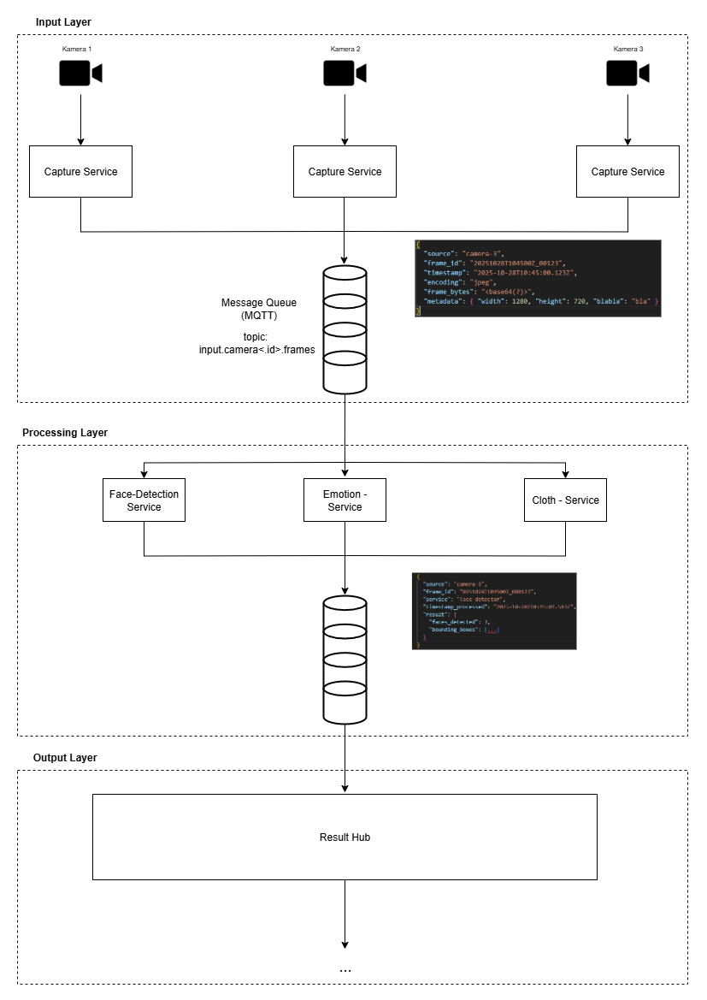

**Input & Output Layer - Architecture Overview**

The system is built around two core messaging components:

* Input Layer: handles real-time sensor data ingestion (e.g., camera frames)
* Output Layer: distributes the processed results (e.g., ML results)

Both layers communicate over a lightweight, high-performance message bus (NATS for input, Kafka for output).
This separation enables modular services and high scalability.

Currently both message bus are setup on a server, so no manual installation is needed.
However, it's possible to connect a custom message bus. The docker compose files for this are provided as well.



**Input Layer**

The Input Layer is responsible for:

* Capturing raw sensor data such as camera frames
* Attaching metadata to each frame
* Publishing the data to NATS
* Providing consumers that can subscribe to the incoming streams

Example: A camera generates JPEG frames which are published under a topic.

*Components*

* InputLayerProducer<br>
Captures frames via OpenCV and publishes them to NATS.

* InputLayerMetadata<br>
  Provides timestamp, encoding, dimensions, and source ID.

* InputLayerConsumer<br>
  Asynchronous consumer that receives each frame and passes it to callback logic.

* InputLayerConsumerThread<br>
  Optional threaded version for low-latency display and background processing.


**Output Layer**

The *Output Layer* handles:

* Collecting results from processing or ML services
* Mapping Input Layer metadata into Output Layer metadata
* Publishing the result into Kafka under a structured topic
* Enabling downstream consumers or dashboards to read the results

Example Output Metadata (will get generated):
```
{
  "source_id": "camera1",
  "service_id": "object_detection",
  "time_stamp": 1713456789,
  "completed_at": 1713456790,
  "result": {
    "status": "ok",
    "objects": ["car", "person"]
  }
}
```

*Components*

* OutputLayerProducer<br>
Sends metadata to Kafka.

* OutputLayerReceiver<br>
Receives metadata from Kafka for further processing or display.

* OutputLayerMonitor<br>
A Flask-based web dashboard for visualizing output metadata.


**Using Input and Output Layers With workflow.py**


*workflow.py* demonstrates a full real-time processing pipeline:
```
Camera -> InputLayerProducer -> NATS -> InputLayerConsumer -> Processing -> OutputLayerProducer -> Kafka

```
Usage:
```
python workflow.py
```

**MORE INFORMATION ON HOW TO USE EACH STEP CAN BE FOUND INSIDE THE workflow.py**

1. Frame Capture and Publishing

The producer captures camera frames and publishes them to NATS:
```
producer = InputLayerProducer(topic, service_name)
grabber = FrameGrabber(...)
await producer.send_frame(grabber, 30)
```

2. Consuming and Processing Frames

The consumer receives frames and processes them:
```
async def handle_message(msg):
    frame = cv2.imdecode(...)
    result = await fake_processing(frame)
```

3. Sending Results to the Output Layer

Processed results are serialized and sent to Kafka:

```
await output_producer.sendMetadata(
    header=msg.headers,
    result=result,
    service_id=service_name
)
```

Metadata is published to a topic named:
```
output.<source_id>.<service_id>
```

**Output Layer Monitor**

The repository includes a *output_layer_monitor.py* which can be used to track the output layer.

**Important Note**

The Output Layer Monitor is **not** automatically deployed as of right now.

To view output messages from Kafka, you must start it manually if you want to checkout the output layer!
Use *python output_layer_monitor.py* to start it and it runs on *http://localhost:5000* after.

